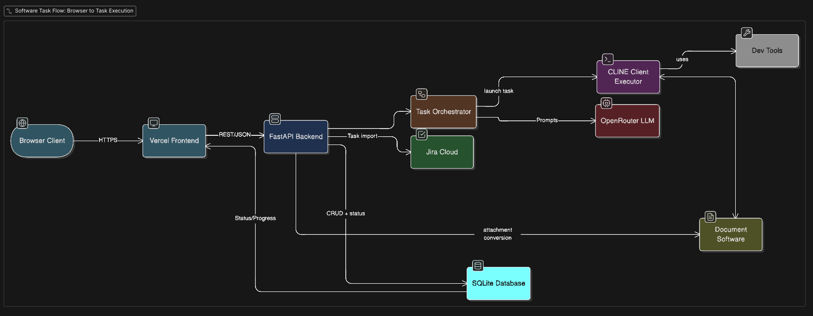

# E2E AI Dev Agent Frontend

A Next.js frontend application built with React 19, Tailwind CSS 4, and shadcn/ui components.

## Tech Stack

- **Framework:** Next.js 16
- **Language:** TypeScript
- **Styling:** Tailwind CSS 4
- **UI Components:** shadcn/ui (Radix UI primitives)
- **Forms:** React Hook Form + Zod validation

## Prerequisites

- Node.js 18+ (recommended: 20+)
- npm, yarn, pnpm, or bun

## Getting Started

### 1. Clone the repository

```bash
git clone <repository-url>
cd e2e-ai-dev-agent-frontend
```

### 2. Install dependencies

```bash
npm install
```

### 3. Set up environment variables

Copy the example environment file and configure it:

```bash
cp env.example .env.local
```

Edit `.env.local` and set your backend URL:

```
NEXT_PUBLIC_BACKEND_URL="https://your-backend.example.com"
```

### 4. Run the development server

```bash
npm run dev
```

Open [http://localhost:3000](http://localhost:3000) in your browser to see the application.

## Available Scripts

| Command         | Description              |
| --------------- | ------------------------ |
| `npm run dev`   | Start development server |
| `npm run build` | Build for production     |
| `npm run start` | Start production server  |
| `npm run lint`  | Run ESLint               |

## Project Structure

```
├── app/              # Next.js App Router pages and layouts
├── components/       # React components
│   └── ui/           # shadcn/ui components
├── lib/              # Utility functions and API helpers
├── public/           # Static assets
└── ...config files
```

## High Level Architecture

This is a high level architecture of the application.

## 

## Backend

The backend for this application provides the AI-powered development agent functionality. It handles code generation, project management, and integration with various development tools.

**Repository:** [e2e-ai-dev-agent](https://github.com/805karansaini/e2e-ai-dev-agent/)

For detailed backend documentation and setup instructions, please refer to the [backend repository](https://github.com/805karansaini/e2e-ai-dev-agent/).
